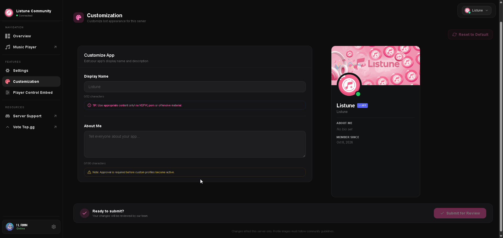

# Custom Bot Profile

The Custom Profile Bot feature on the web dashboard allows server administrators to personalize how Listune presents itself in their server.

With an active Guild Premium plan, your community can give the bot a custom nickname, localized biography, custom avatar image, and banner artwork.

## Profile Customization Options

### Server Nickname
- **Limit**: Maximum 32 characters.
- **Purpose**: Changes the bot display name in your server member list, chat headers, and mention replies.

### Server Biography (About Me)
- **Limit**: Maximum 190 characters.
- **Purpose**: Replaces the default bot about text with a personalized message, community guidelines, or server radio schedule.

### Custom Avatar
- **File Format**: PNG, JPEG, GIF, or WebP.
- **Size Limit**: Maximum 2 MB (client-side processing automatically scales avatars to 512x512 pixels).
- **Purpose**: Displays your community logo or mascot as the bot profile picture inside your server.

### Custom Banner
- **File Format**: PNG, JPEG, GIF, or WebP.
- **Size Limit**: Maximum 2 MB (scaled to 960x540 pixels).
- **Purpose**: Sets custom header artwork when users click on the bot user card in Discord.

## Review and Verification Process

To ensure compliance with Discord Developer Terms of Service and maintain server safety, all custom profile submissions pass through a moderation queue:

1. **Submission**: Configure your desired nickname, bio, avatar, and banner in the dashboard and click **Submit for Review**.
2. **Pending State**: The dashboard displays a pending review indicator. During this time, the bot maintains its previous profile.
3. **Approval**: Once verified by the moderation review system, the new profile updates automatically across your Discord server without requiring a bot restart.
4. **Rejection Handling**: If a submission is rejected (for instance, due to copyrighted material or inappropriate imagery), the dashboard displays the specific rejection reason so you can adjust your assets and resubmit.

## Requirements

- **Server Plan**: Custom Bot Profiles require an active **Guild Basic** or **Guild Plus** tier via Patreon.
- **Permissions**: You must have the **Manage Server** permission in Discord to submit or reset profile data.
