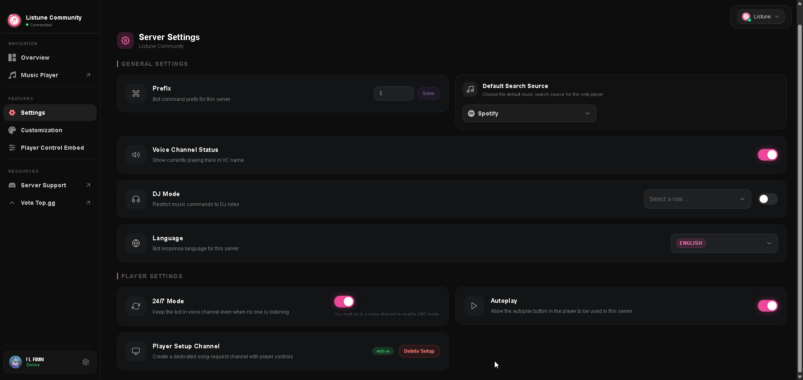

# Guild Settings

The Guild Settings section on the web dashboard gives administrators full control over server configuration without needing to run individual text commands.

## Available Settings

### 1. Command Prefix
- **Where to find it**: General Settings card on the dashboard.
- **What it controls**: The character prefix used for text commands in Discord channels (default: `!`).
- **Effect of changes**: Takes effect immediately across all text channels in the guild. Does not affect slash command execution or direct bot mentions.

### 2. Default Search Source
- **Where to find it**: General Settings card.
- **What it controls**: The default streaming provider queried when users submit plain text search queries without specifying a platform URL.
- **Supported Options**: SoundCloud, Spotify, Apple Music, YouTube, YouTube Music, Deezer, and Tidal.
- **Effect of changes**: The Web Player and bot slash commands prioritize your selected audio provider for query resolution.

### 3. Voice Channel Status
- **Where to find it**: General Settings card.
- **What it controls**: Automatically renames the connected voice channel to reflect the currently playing song title and artist.
- **Requirements**: The bot must have the **Manage Channels** permission in Discord to update the channel name.
- **Effect of changes**: Updates dynamically as new songs begin playing and resets when playback concludes.

### 4. DJ Role System
- **Where to find it**: General Settings card.
- **What it controls**: Restricts music controls (pause, skip, volume, audio filters, queue clearing) to members who possess a specific Discord role.
- **Effect of changes**: When enabled, members without the designated DJ role or the Discord Manage Server permission cannot manipulate the queue unless they are the original requester of the active track.

### 5. Bot Language
- **Where to find it**: General Settings card.
- **What it controls**: The localization dictionary applied to command responses, player cards, and help menus sent into server text channels.

### 6. 24/7 Voice Channel Mode
- **Where to find it**: Player Settings card.
- **What it controls**: Prevents the bot from disconnecting when the queue empties or when human listeners leave the voice channel.
- **Requirements**: Requires an active Premium subscription. The bot must currently be in a voice channel when enabling this setting.
- **Effect of changes**: Keeps Listune permanently connected to your designated voice channel so music is always ready on demand.

### 7. Autoplay Toggle
- **Where to find it**: Player Settings card.
- **What it controls**: Controls whether listeners in the server can engage the Autoplay mode.
- **Effect of changes**: When enabled, the player automatically samples similar tracks based on previous queue history when the last track finishes.

### 8. Player Setup Channel
- **Where to find it**: Player Settings card.
- **What it controls**: Creates or removes a dedicated song-request channel.
- **Effect of changes**: Automatically generates a clean text channel containing a persistent player embed with interactive playback buttons. Users can queue songs by typing song titles directly into the channel without typing any prefix or slash command.
