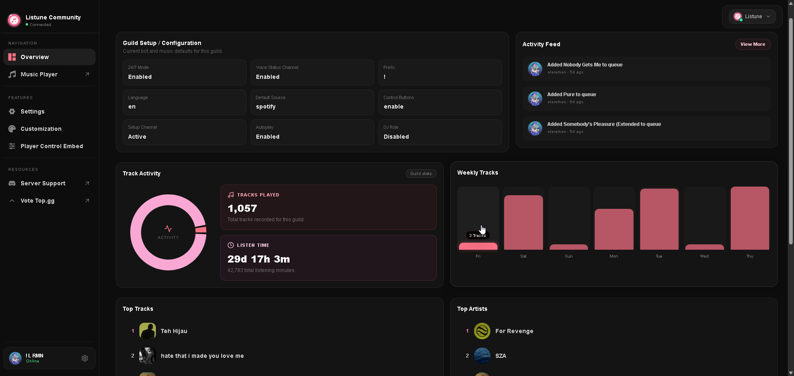

# Guild Statistics

The Guild Statistics view on the web dashboard gives server administrators a clear breakdown of their community music listening trends and activity history.



## Available Metrics

### Tracks Played
The total cumulative count of songs that have been played in the server since Listune joined. This counter increments each time a queued song finishes playing or passes the minimum duration threshold.

### Listen Time
The total time server members have spent listening to music together, aggregated across all voice channels and playback sessions. The dashboard formats this duration into days, hours, and minutes (for example: `12d 8h 35m`).

### Top Tracks Leaderboard
A ranked list of the most popular songs played within the server:
- Shows the song ranking (1 to 10).
- Displays track artwork, title, and artist metadata.
- Allows listeners to identify recurring community favorites.

### Top Artists Leaderboard
A ranked list of the most played artists across the server:
- Ranks the most popular artists based on aggregate track plays.
- Displays circular artist thumbnails and artist names.
- Helps community leaders understand member music tastes for server events and listening sessions.

## Accessing Server Stats in Discord

You can also pull this information directly inside Discord using the slash command:
```text
/guild stats
!guildstats
!gstats
```
