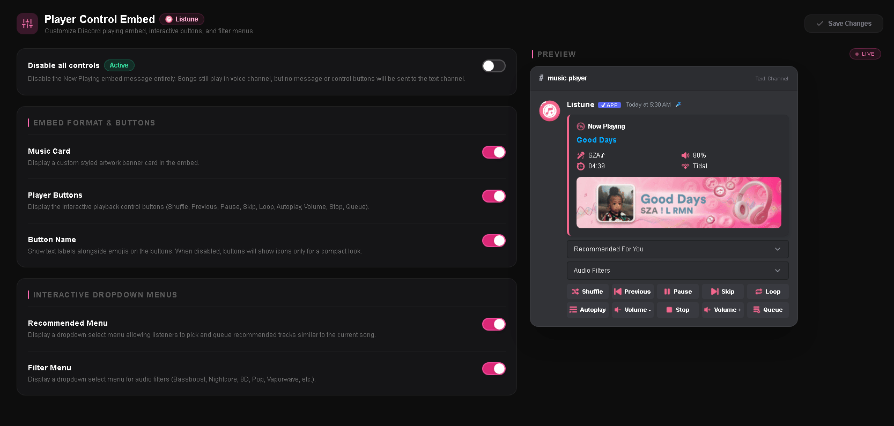

# Player Control & Embeds

The Player Control section on the web dashboard allows server administrators to customize how the Listune player looks, behaves, and presents itself in Discord text channels.

A server can choose whether to display full interactive controls or clean text cards, and fine-tune every button row and dropdown menu.

## Available Settings

The dashboard organizes player customization into six distinct switches:

### 1. Control Mode (Disable All Controls)
- **What it does**: When enabled, completely suppresses all interactive buttons and dropdown menus from now-playing messages.
- **Why use it**: Useful for large, high-traffic servers where members might abuse buttons, or in announcement channels where you only want clean track information without clutter.
- **Effect**: Messages contain only the track title, artist, duration, requester, and artwork.

### 2. Display Style (Music Card vs Components V2)
- **What it does**: Chooses between a rendered graphical Canvas Music Card image or native Discord Components V2 containers.
- **Options**:
  - **Music Card Image**: Generates a custom graphical banner with waveforms, track cover art, and progress bars.
  - **Components V2 Container**: Renders using Discord native interactive card layout for fast loading and low bandwidth usage.

### 3. Player Control Buttons
- **What it does**: Toggles the interactive playback button rows on the now-playing message.
- **Controls Included**: Play, Pause, Previous, Skip, Stop, Volume Up, Volume Down, Loop Mode, Shuffle, and Autoplay.
- **Effect**: Turning this off removes the button rows while preserving track metadata and menus.

### 4. Button Labels
- **What it does**: Toggles text labels beside each button icon.
- **Effect**:
  - **Enabled**: Buttons show both icon and descriptive text (e.g. "Pause", "Skip", "Shuffle").
  - **Disabled**: Buttons display in a compact, icon-only format.

### 5. Audio Filters Menu
- **What it does**: Controls whether an interactive dropdown selector for audio filters appears directly beneath the player card.
- **Effect**: When enabled, listeners can pick filters (such as Bassboost, Nightcore, 8D, or Vaporwave) directly from the select menu without typing filter commands.

### 6. Recommendation Menu
- **What it does**: Controls whether an interactive music recommendations dropdown appears below the player message.
- **Effect**: Provides listeners with instant access to related songs based on the currently playing track.

## Live Dashboard Preview

The Player Control view includes an interactive **Preview** tab directly next to the configuration controls. This preview dynamically simulates how Discord renders your player layout with your exact button and embed choices, allowing you to review your changes before pressing **Save Changes**.
