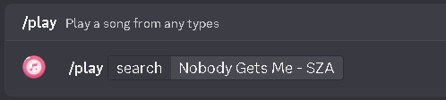
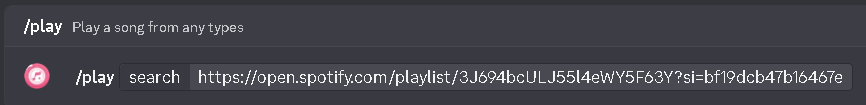

# Play Queries

Listune accepts flexible query formats through the `/play` slash command, prefix commands (`!play`), or direct bot mentions.

## Text Search Queries

If you do not have a direct web link, you can search for any song by typing its title, artist, or a combination of both.

```text
/play search:Rick Astley Never Gonna Give You Up
!play Bohemian Rhapsody Queen
@Listune play Radiohead Creep
```

When you enter a search term into `/play search:`, Discord provides live auto-completion suggestions matching your keywords across supported music platforms.



### Search Tips

- Include both the song title and artist name for the most accurate top result.
- Avoid using pure emoji sequences as search inputs, as the bot rejects emoji-only queries to prevent processing errors.
- If you want to review multiple search candidates before playing, use the `/search` command instead. This command opens an interactive multi-tab browser allowing you to view matching Songs, Artists, Albums, and Playlists.

## Direct URL Playback

You can paste full URLs directly into the play parameter. Listune automatically detects the streaming service and resolves the underlying audio stream.

```text
/play search:https://open.spotify.com/track/4cOdK2wGLETKBW3PvgPWqT
/play search:https://music.youtube.com/watch?v=dQw4w9WgXcQ
/play search:https://soundcloud.com/artist/track-name
```

## Playlist Imports

Listune supports loading entire playlists into the server queue with a single command. Supported playlist sources include Spotify playlists, YouTube playlists, Apple Music playlists, Deezer collections, and SoundCloud sets.



```text
/play search:https://open.spotify.com/playlist/37i9dQZF1DXcBWIGoYBM5M
/play search:https://www.youtube.com/playlist?list=PL4fGSI1pDJn6jXS_PEoNctW2LyNVvsGTB
```

### Playlist Rules and Limits

- **Free Tier Limit**: On servers without an active Premium subscription, queues have a maximum track limit (default: 100 to 150 songs). If a playlist exceeds this limit, only tracks up to the limit are enqueued.
- **Premium Tier**: Servers with an active Premium subscription receive expanded or unlimited queue capacities (up to 550 songs on Guild Basic, unlimited on Guild Plus).
- **Private Playlists**: Playlists must be public or unlisted. The bot cannot load playlists set to private or restricted by personal login credentials.
