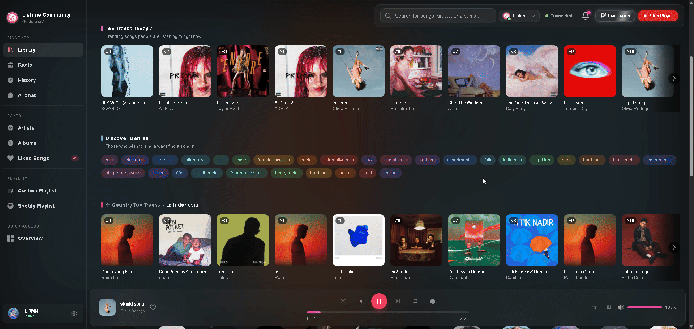

# Web Player

The Listune Web Player provides a browser-based audio control surface synchronized with your Discord voice channel in real time.

## Video Demonstration

Watch the complete demonstration of the Listune Web Player in action:

[!button text="Watch Web Player Demo on YouTube" target="blank"](https://www.youtube.com/watch?v=uSoBMGahnmM)

  <iframe width="100%" height="100%" src="https://www.youtube-nocookie.com/embed/uSoBMGahnmM" title="Listune Web Player Demo" frameborder="0" allow="accelerometer; autoplay; clipboard-write; encrypted-media; gyroscope; picture-in-picture" allowfullscreen></iframe>

## Key Features

### Synchronized Live Lyrics
The Web Player connects to synchronized lyric engines, providing a real-time karaoke display. As the track plays in your voice channel, the active lyric line highlights automatically in sync with the vocals.

### Queue Manipulation
- **Drag and Drop Reordering**: Reorder upcoming songs simply by dragging them to new queue positions.
- **Instant Removal**: Delete unwanted tracks from the queue with a single click.
- **Search and Add**: Search for songs across Spotify, YouTube, Apple Music, and SoundCloud and enqueue them directly from the web interface.

### Playback Controls
- **Scrubber Bar**: Seek to any exact second in the track.
- **Volume Slider**: Adjust the bot output volume smoothly from 1% to 100%.
- **Mode Toggles**: Toggle repeat modes (Track, Queue, Off) and shuffle upcoming tracks.
- **Audio Filters Panel**: Enable real-time DSP audio filters including Bassboost, Nightcore, 8D, and Vaporwave directly from a visual switchboard.

### Music Library and Collections
- **Liked Songs**: Save tracks to your personal collection with the heart button.
- **Custom Playlists**: Create, edit, and launch personal playlists directly from the browser.
- **Listening History**: Review previously played songs and re-queue them instantly.
- **Global Radio**: Switch the voice channel stream to international live radio stations.

### Persistent Mini Player
When navigating away from the full-screen player to manage server settings or view statistics, a compact floating mini player docks at the corner of your screen. You can dock it to the left or right side, pause, skip, adjust volume, and view the upcoming queue without interrupting your workflow.

## How to Access the Web Player

1. Join a voice channel in your Discord server.
2. Visit [listune.app](https://listune.app) and log in with your Discord account.
3. Select your server from the server list, then click **Music Player** in the sidebar.
4. If the bot is active in voice, your player session synchronizes immediately via real-time WebSocket connection.
